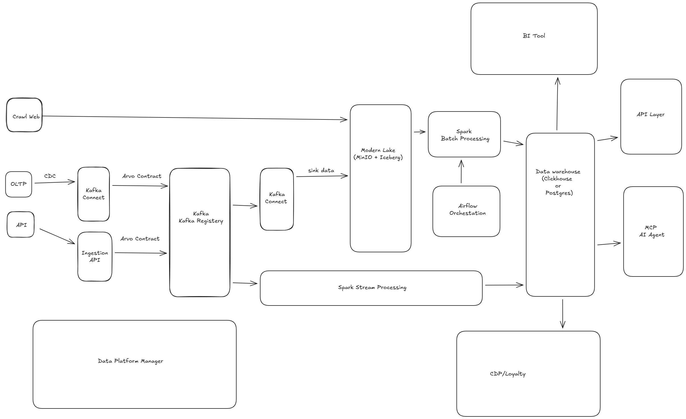

# 🚀 Modern Data Platform for Real-time Analytics & CDP

## 📌 Overview

This project is a modern, scalable data platform designed to ingest, process, and serve data in both real-time and batch for analytics, BI, APIs, and CDP/Loyalty use cases.

The platform follows a **lakehouse-oriented architecture**, combining streaming (Kafka + Spark Streaming) and batch processing (Spark + Airflow), with a Modern Data Lake (MinIO + Iceberg) as the central storage layer and a Data Warehouse (ClickHouse/PostgreSQL) as the serving layer.

It is built to support:
- **High-throughput ingestion** (CDC, APIs, web crawling)
- **Schema governance** with Avro
- **Real-time & batch analytics**
- **Data services** for BI, APIs, and AI Agents (MCP)
- **Customer Data Platform (CDP)** and Loyalty systems

---

## 🏗️ Architecture Overview

### 1️⃣ Data Sources
- **OLTP systems** (via CDC)
- **External APIs**
- **Web crawling / scraping**
- **Internal services**

### 2️⃣ Ingestion Layer
- **Kafka Connect**:
  - CDC from OLTP databases
  - Sink connectors to Modern Lake
- **Custom Ingestion API**: Unified entry point for API-based ingestion
- **Apache Kafka**: Central event backbone
- **Schema Registry (Avro)**:
  - Strong schema contracts
  - Backward/forward compatibility
  - Data quality & governance

### 3️⃣ Modern Data Lake (Lakehouse)
- **MinIO** as object storage
- **Apache Iceberg**:
  - Table format with ACID transactions
  - Time travel & schema evolution
  - Unified storage for batch & streaming
- **Acts as**:
  - Raw zone
  - Cleaned/processed zone
  - Long-term historical storage

### 4️⃣ Processing Layer
#### 🔄 Streaming Processing
- **Spark Structured Streaming**
- **Consume Kafka topics**
- **Near real-time transformations**
- **Write directly to Data Warehouse**
- **Use cases**:
  - Real-time metrics
  - Event aggregation
  - Feature generation for CDP

#### 📦 Batch Processing
- **Apache Spark (Batch)**:
  - Heavy transformations
  - Reprocessing & backfills
  - Large-scale joins & aggregations
- **Airflow**:
  - Job orchestration
  - Scheduling & dependency management
  - Monitoring & retry logic

### 5️⃣ Serving Layer – Data Warehouse
- **ClickHouse** (for high-performance analytics) **OR** **PostgreSQL** (for general-purpose analytics & APIs)
- **The warehouse serves as**:
  - Single source of truth for analytics
  - Low-latency query layer
  - Data source for downstream systems

### 6️⃣ Data Consumption
- **BI Tools**: Dashboards & reports, Ad-hoc analytics
- **API Layer**:
  - Data services for internal & external consumers
  - Modular, permission-based access
- **CDP / Loyalty System**:
  - Customer profiles
  - Segmentation
  - Behavioral analytics
- **MCP AI Agent**:
  - AI-powered data access
  - Analytics & reasoning on top of warehouse data

### 7️⃣ Platform Management
- **Data Platform Manager**:
  - Metadata & pipeline visibility
  - Tracking data sources & consumers
  - Operational monitoring & governance

---

## 🎯 Key Design Principles
- **Event-driven & schema-first**
- **Streaming-first, batch-compatible**
- **Lakehouse-centric architecture**
- **Loose coupling** between ingestion, processing, and serving
- **Scalable** from startup to enterprise
- **Cloud-native & open-source friendly**

## 🧩 Typical Use Cases
- **Real-time dashboards**
- **CDC-based analytics**
- **Customer 360 & CDP**
- **Feature store for AI/ML**
- **API-driven data products**
- **Internal data services for BI & operations**

## 📈 Why This Architecture?
| Component | Benefit |
|-----------|---------|
| **Kafka + Avro** | Data consistency at scale |
| **Iceberg** | Future-proof data lake |
| **Spark** | Unified batch & streaming |
| **ClickHouse/Postgres** | Fast analytics & flexible serving |
| **Airflow** | Reliable orchestration |
| **API + AI Agent** | Data as a product |
